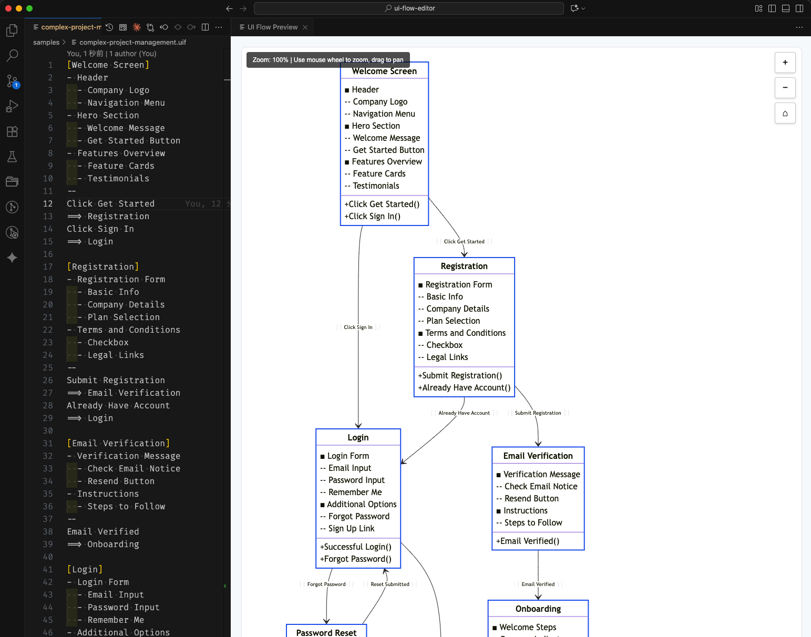
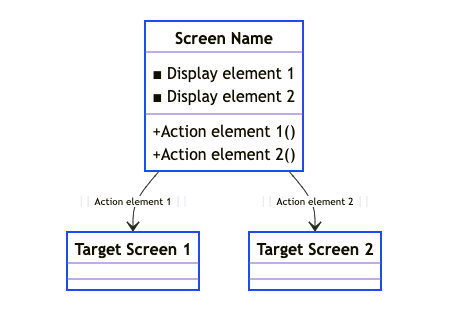
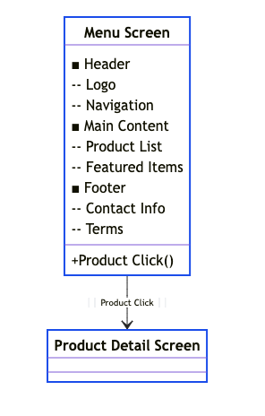
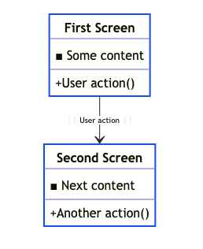
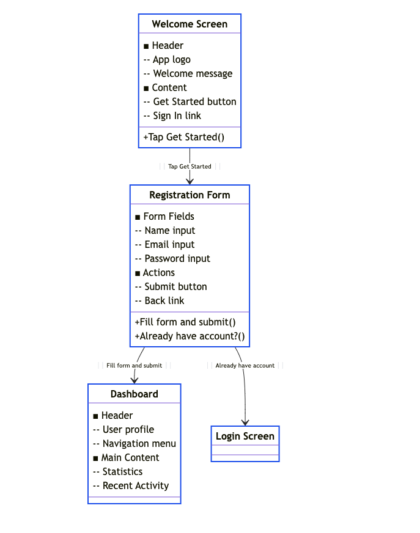

# UI Flow Editor

A Visual Studio Code extension for creating interactive UI flow diagrams.



## Features

* Interactive Preview: Mermaid.js-powered class diagrams with zoom and pan functionality
* Hierarchical Display Elements: Support for Markdown list syntax with parent-child relationships
* HTML Export: Export diagrams as standalone HTML files with interactive controls
* Auto-completion: Smart completion for UI flow syntax

## What are UI Flows?

UI Flows are simplified diagrams for describing user interface workflows, focusing on:

* What users see
* What users do

This approach allows you to describe the essential requirements or structure of UI without getting into specific design details.

Learn more: [A shorthand for designing UI flows - 37signals](https://signalvnoise.com/posts/1926-a-shorthand-for-designing-ui-flows)

## Quick Start

1. Install the UI Flow Editor extension
2. Create a new file with `.uif` extension
3. Write your UI flow using the simple syntax
4. Press `Ctrl+Shift+V` (macOS: `Cmd+Shift+V`) to preview

## Syntax

### Basic Block Structure

```text
[Screen Name]
Display element 1
Display element 2
--
Action element 1
==> Target Screen 1
Action element 2
==> Target Screen 2
```



### Hierarchical Display Elements

Use Markdown list syntax to create hierarchical structures:

```text
[Menu Screen]
- Header
  - Logo
  - Navigation
- Main Content
  - Product List
  - Featured Items
- Footer
  - Contact Info
  - Terms
--
Product Click
==> Product Detail Screen
```



### Separators

The following separator patterns are supported:

* `--` (2 hyphens)
* `---` (3 hyphens)

### Auto-connection

Actions without explicit targets automatically connect to the next block.

```text
[First Screen]
Some content
--
User action

[Second Screen]
Next content
--
Another action
```



## Example

```text
[Welcome Screen]
- Header
  - App logo
  - Welcome message
- Content
  - Get Started button
  - Sign In link
--
Tap Get Started

[Registration Form]
- Form Fields
  - Name input
  - Email input
  - Password input
- Actions
  - Submit button
  - Back link
--
Fill form and submit
==> Dashboard
Already have account?
==> Login Screen

[Dashboard]
- Header
  - User profile
  - Navigation menu
- Main Content
  - Statistics
  - Recent Activity
```



## Commands

* Preview UI Flow (`Ctrl+Shift+V` / `Cmd+Shift+V`): Open interactive preview
* Export as HTML (`Ctrl+Shift+S` / `Cmd+Shift+S`): Export diagram as HTML file

## Features in Detail

### Interactive Diagrams

* Mouse wheel zoom (10%-300%)
* Drag to pan around large diagrams
* Zoom controls with reset button
* Real-time zoom level display

### Export Options

* Standalone HTML files with embedded Mermaid.js
* Viewable in any modern browser
* Preserves zoom and pan functionality after export
* Self-contained files with no external dependencies
